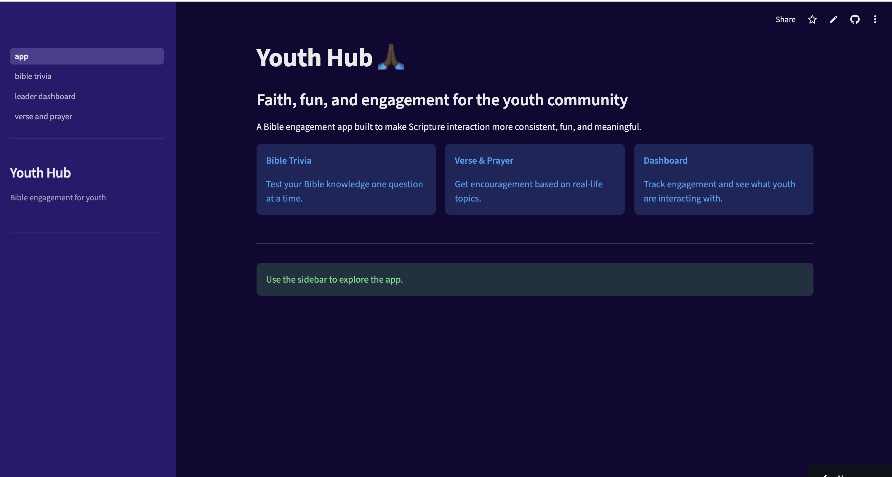

# Youth Bible Engagement App 🙏🏿



A lightweight interactive web app designed to increase Bible engagement among youth (ages 18–30) through trivia, daily encouragement, and simple reflection tools.

The app combines Bible-based interaction, AI-assisted encouragement, and engagement analytics to support youth ministries in making Scripture interaction more consistent and engaging.

Built with Python, Streamlit, and simple data analytics tools.

## Why This App Exists

Youth ministries often struggle with one common challenge:

This is a challenge I have faced myself being a youth leader

- Maintaining consistent engagement with Scripture outside church services.

Many young adults are:

- busy with school or work

- overwhelmed by information online

- unsure where to start reading the Bible

- more responsive to interactive digital tools

This app was designed to provide simple, low-friction entry points to Scripture interaction.
Instead of expecting long reading sessions, it focuses on:

- quick Bible trivia

- topic-based encouragement

- short reflection prompts

- simple prayer generation

These small interactions make Scripture engagement easier to start and repeat.
The goal is not to replace traditional Bible study, but to encourage frequent touchpoints with Scripture.

## Key Features ⚙️
**Bible Trivia**

An interactive trivia system where users can test their Bible knowledge.

### Features:

- Difficulty levels (Easy, Medium, Hard)
- Randomized questions
- Score tracking during each session
- Verse references shown after each answer

This helps reinforce Bible knowledge in a fun and low-pressure format.

## Verse & Prayer Generator

Users can select a life topic such as:

- Stress
- Healing
- Joy
- Anxiety
- Fear

The app will:

Select a relevant Bible verse
- Display the verse text
- Generate a short explanation
- Generate a short prayer
- Provide a reflection question

If the AI service is unavailable, the app uses a built-in fallback encouragement system so the experience continues smoothly.

## Leader Dashboard

A simple analytics dashboard designed for youth leaders.

The dashboard tracks engagement such as:

- number of trivia attempts
- accuracy across difficulty levels
- most requested encouragement topics
- most frequently shown verses
- fallback usage when AI is unavailable

This allows leaders to see how youth are interacting with the app.

## Project Structure
```
Youth-App
│
├── app.py
├── pages/
│   ├── bible_trivia.py
│   ├── verse_prayer.py
│   └── leader_dashboard.py
│
├── utils/
│   ├── bible_reader.py
│   ├── llm.py
│   ├── fallback.py
│   └── storage.py
│
├── data/
│   ├── bible/
│   ├── trivia_questions.csv
│   └── topic_to_verses.json
│
├── requirements.txt
└── README.md
```
## Bible Text Source ✅

This project uses the World English Bible (WEB) dataset from GitHub.

Repository:
https://github.com/TehShrike/world-english-bible

The World English Bible is in the public domain, which allows it to be freely used for projects like this.

The JSON Bible files used in this project come from that repository.

All credit for the translation belongs to the original maintainers of the World English Bible.

The questions come from [Logos Bible Trivia](https://www.logos.com/grow/100-bible-trivia-questions/) and [Minsitry to Children](https://ministry-to-children.com/kids-bible-trivia/)


## Technology Stack ⚙️

Python

- Streamlit
- Pandas
- OpenRouter (for AI-generated explanations and prayers)
- Local JSON Bible dataset
- Running the App Locally

### Install dependencies:

``` pip install -r requirements.txt ```

### Run the app:

``` streamlit run app.py ```

### Deployment

The app is designed to be deployed easily using Streamlit Community Cloud.

Steps:

1. Push the project to GitHub
2. Connect the repository to Streamlit Community Cloud
3. Set the main file to:

```app.py```

4. Add the OpenRouter API key in Streamlit Secrets.

### Example:

OPENROUTER_API_KEY = "your_key_here"

### Future Improvements 

Potential future enhancements include:

- user accounts for tracking engagement over time
- streaks or daily verse notifications
- more advanced leader analytics
- database-backed storage instead of CSV logging
- improved question datasets
- optional group discussion prompts

### Project Goal 🎉

The long-term goal is to explore how simple digital tools can increase youth interaction with Scripture.

Small, consistent interactions can help build habits that eventually lead to deeper Bible study and spiritual growth.